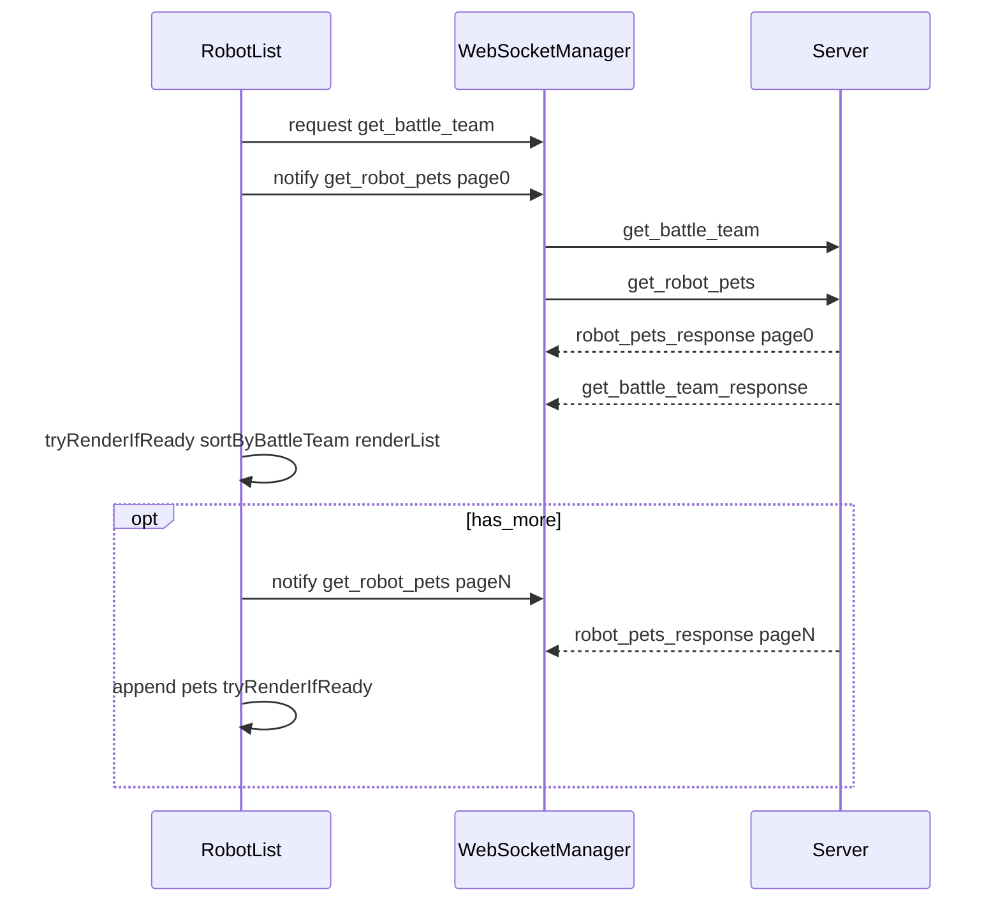

# 机甲列表全局排查与优化计划

## 范围与主链路

- **核心 UI 逻辑**：[assets/Script/Game/RobotList.ts](d:\jjfbol-cocos\jjfbol-cocos\jjfb\assets\Script\Game\RobotList.ts)（列表渲染、行点击、Set 面板、出战/放生、确认选择）
- **背包联动**：[assets/Script/Game/BagItem.ts](d:\jjfbol-cocos\jjfbol-cocos\jjfb\assets\Script\Game\BagItem.ts)（`useItemForPet` → `setCallbacks` → `show(true)` → `confirmUseItemForPet` → `hide`）
- **网络**：[assets/Script/global/WebSocketManager.ts](d:\jjfbol-cocos\jjfbol-cocos\jjfb\assets\Script\global\WebSocketManager.ts)（`request` vs `notify`）
- **缓存**：[assets/Script/global/DataCacheManager.ts](d:\jjfbol-cocos\jjfbol-cocos\jjfb\assets\Script\global\DataCacheManager.ts)（`setRobotPetsCache` / `getRobotPetsCache`）
- **服务端列表**：[server/handlers/robot_handler.py](d:\jjfbol-cocos\jjfbol-cocos\jjfb\server\handlers\robot_handler.py) 中 `handle_get_robot_pets`（分页、`slot_index` 排序）
- **属性面板**：[assets/Script/Game/RobotAttributePanel.ts](d:\jjfbol-cocos\jjfbol-cocos\jjfb\assets\Script\Game\RobotAttributePanel.ts)（`RobotList.onView` / `onConfirm` 无回调分支）

## 已识别问题（按严重度）

### P0：功能/安全类（会直接导致“操作怪、失败、越权感”）

1. **放生走管理员路由**  
   - `RobotList.releasePet` 使用 `'admin_delete_robot_pet'`（见 [RobotList.ts 约 L979–995](d:\jjfbol-cocos\jjfbol-cocos\jjfb\assets\Script\Game\RobotList.ts)）。  
   - 服务端该路由在 [server/router.py](d:\jjfbol-cocos\jjfbol-cocos\jjfb\server\router.py) 中归属 **admin**。正常玩家要么一直失败，要么若误放行则属于严重安全问题。  
   - **结论**：应改为**玩家可用的放生/删除机甲**业务路由（handler 内校验 `user_id` + `character_id` + `pet_id` 归属），或暂时在 UI 上禁用放生直至后端就绪。

2. **列表分页请求用 `notify`，无 `request_id` 对齐，存在乱序/竞态风险**  
   - `requestPets` 使用 `ws.notify('get_robot_pets', …)`（[RobotList.ts L326–341](d:\jjfbol-cocos\jjfbol-cocos\jjfb\assets\Script\Game\RobotList.ts)），多页时依赖 `pagination.page` 合并。  
   - 若网络层重排、重复推送或并发打开列表，可能出现 **page1 先于 page0 到达** 时 `currentPets` 拼接错误（`page===0` 分支与 append 分支）。  
   - **结论**：多页加载改为 **`request` + 每页唯一 request_id**（或服务端在响应中带 `client_seq`），客户端按 seq 丢弃过期响应；至少对 `page>0` 做“若尚未收到 page0 则缓存挂起”的队列。

3. **出战/下场操作的幂等性与重复提交防护不足**  
   - `set_battle_team` 属于状态变更写操作，快速连点“出战/下场”会产生重复提交窗口，最终队伍状态可能“抖动/回滚”。  
   - **建议**：客户端统一使用 `request` 并携带 `request_id`；点击后**立即置灰按钮 + 全局 UI 锁**，直到响应回包再解锁；服务端引入 `team_version`（或等价版本号）进行乐观锁校验，避免乱序写入。

4. **物品使用给机甲的双端权限校验缺失**  
   - 现链路：`BagItem.useItemForPet` 选宠后把 `pet_id` 发给 `bag_use_item`。若服务端未校验 `pet_id` 属于当前 `user_id/character_id`，存在越权与数据异常风险。  
   - **建议**：服务端 `bag_use_item`（`target_type='Pet'`）必须校验：`pet_id` 归属、道具是否可用于该机甲类型/状态（出战/锁定/放生中等）；客户端在打开列表时对不可用机甲置灰并提示。

5. **放生操作的双保险与数据一致性**  
   - 放生若不先从 `battle_team` 移除，会导致战斗/队伍系统引用不存在的机甲。  
   - **建议**：服务端把“下场 → 删除机甲 → 广播更新”打包为一次原子流程（有事务则事务；无事务则顺序写+失败补偿）；客户端收到成功响应后同步更新列表与缓存（`robot_pets_cache` + `battle_team`）。

### P1：显示与交互一致性（“看起来像 bug”的高频来源）

3. **出战队伍排序 vs 服务端 `slot_index` 排序可能冲突**  
   - 服务端 `handle_get_robot_pets` 按 `slot_index` 升序返回（[robot_handler.py L360–375](d:\jjfbol-cocos\jjfbol-cocos\jjfb\server\handlers\robot_handler.py)）。  
   - 客户端 `sortByBattleTeam` 再把出战宠提到最前（[RobotList.ts L398–427](d:\jjfbol-cocos\jjfbol-cocos\jjfb\assets\Script\Game\RobotList.ts)）。  
   - **现象**：非出战部分仍保持 DB slot 顺序，出战部分按队伍顺序；用户可能感觉“顺序忽变/与养成栏不一致”。  
   - **结论**：二选一作为产品规则并写死：**(A)** 完全信任服务端顺序（含 slot），客户端只做出战高亮；**(B)** 服务端直接返回 `battle_team` 或在 payload 里给 `display_order`，避免双源排序。

4. **`setDeployReleaseButtonsInteractable` 未覆盖模板行（第一行）**  
   - 仅遍历 `listItems`（[RobotList.ts L779–792](d:\jjfbol-cocos\jjfbol-cocos\jjfb\assets\Script\Game\RobotList.ts)），而第一行通常用的是 `robotListDataTemplate`，不在 `listItems` 里。  
   - **现象**：提交出战队伍时，第一行的出战/放生仍可点，造成重复请求或状态错乱。

5. **行级事件绑定在反复 `renderList` 时易累计**  
   - `bindSetAndActions` 对子按钮使用 `n.off(Button.EventType.CLICK)` / `on(...)`（[RobotList.ts L694–712](d:\jjfbol-cocos\jjfbol-cocos\jjfb\assets\Script\Game\RobotList.ts)）。在 Cocos 中若 `off` 未绑定同一 `this`/回调，可能 **清不干净或误清**，表现为：点一次触发多次、或某些机型上偶发失效。  
   - **结论**：改为**稳定回调引用**（类方法 + `bind` 存 Map）或 `targetOff(this)` 后重建，保证幂等。

6. **MechaClass 图标帧名依赖编辑器图集**  
   - `fillRow` 用 `gedou/sheji/quanneng` 多候选（[RobotList.ts L508–580](d:\jjfbol-cocos\jjfbol-cocos\jjfb\assets\Script\Game\RobotList.ts)），否则走拖拽的 `mechaIcon*`。  
   - **现象**：图标错类、空白、或“看起来像别的机甲”——与资源命名强耦合。  
   - **结论**：在资源侧固定帧名规范，或改为 `Class -> 明确资源 UUID` 的配置表，减少运行时猜测。

7. **全局 UI 状态管理未统一（与背包系统对齐）**  
   - 机甲列表涉及：加载列表/翻页、出战提交、放生、从背包选宠确认等多条异步链路，若缺少统一锁与按钮态复位，容易出现“按下态残留/一直禁用/弹窗互斥冲突”。  
   - **建议**：复用已有 `UILockManager`：网络请求、弹窗打开、动画播放期间加锁；`onDisable()` 强制重置按钮与选中态；所有按钮加入统一 300ms 防抖；补“加载中遮罩/占位”。

8. **列表渲染性能与事件绑定可维护性**  
   - 目标场景：机甲数量 100+、频繁打开/关闭、滚动。  
   - **建议**：行对象池（可见行数 + 冗余）+ 增量渲染（仅更新变更行）；行内按钮绑定采用稳定回调引用，避免 `off()` 不彻底导致的多次触发。

9. **选中态与出战态叠加导致视觉不清晰**  
   - 当前是通过 `Sprite.color` 叠加（黄选中、红出战），容易互相覆盖或恢复错色。  
   - **建议**：视觉分层：选中使用背景高亮、出战使用边框/角标；并支持“从背包打开时自动定位并选中目标机甲”（提升可用性）。

### P2：联动与缓存（偶现、难复现）

7. **首屏缓存条件过严：`hasFullCache` 要求 `battle_team` 真值**  
   - [RobotList.ts L293–300](d:\jjfbol-cocos\jjfbol-cocos\jjfb\assets\Script\Game\RobotList.ts)：`cachedData.battle_team` 为空数组时 `hasFullCache` 为 false，导致 **无法走“先缓存后刷新”**，每次冷启动都双请求。  
   - 若希望优化打开速度，应把 **空队伍也视为合法缓存**（`Array.isArray` 即可）。

8. **`setRobotPetsCache` 写入的 `battle_team` 可能与列表响应不同步**  
   - `onPetsResponse` 在 `page===0` 时用 **当前内存** `this.battleTeam` 写入缓存（[RobotList.ts L376–381](d:\jjfbol-cocos\jjfbol-cocos\jjfb\assets\Script\Game\RobotList.ts)）。若出战队请求晚于列表响应，会缓存“旧队伍+新列表”。  
   - **结论**：缓存应 **以 get_battle_team 响应为准**再写入，或分字段版本号；或在列表响应中让服务端带 `battle_team`（单一数据源）。

9. **背包选宠与 `RobotList.hide` 时序**  
   - `confirmUseItemForPet` 先 `hide` 再发 `bag_use_item`（[BagItem.ts L2042–2083](d:\jjfbol-cocos\jjfbol-cocos\jjfb\assets\Script\Game\BagItem.ts)）。一般可行，但若 `hide` 触发 `onDisable` 清理与网络刷新交错，可能产生 **闪屏/空列表再打开**。  
   - **结论**：明确规范：`hide` 只关 UI，不 `forceRefresh`；或延迟 `forceRefresh` 到 `onUseItemResponse` 之后（与现有背包刷新策略对齐）。

10. **`RobotList.onView` / 无 `confirmCb` 的 `onConfirm` 与 `robotPanel` 联动**  
    - 依赖 `robotPanel` 上动态组件名 `RobotAttributePanel`（[RobotList.ts L759–770](d:\jjfbol-cocos\jjfbol-cocos\jjfb\assets\Script\Game\RobotList.ts)）。若场景未绑定或组件未就绪，表现为 **点了查看没反应** 或列表已 `hide` 面板未开。

11. **多数据源一致性问题（get_robot_pets + get_battle_team）**  
   - 并行请求任一延迟/失败，会造成“列表渲染与出战状态不同步”。  
   - **建议**：服务端改造为单一数据源：`get_robot_pets` 响应直接包含 `battle_team`（或 `display_order/team_version`），客户端减少并发依赖。

12. **网络异常与超时兜底不足**  
   - 超时/失败时若 UI 不回滚，会出现按钮永久禁用、加载一直转等。  
   - **建议**：统一超时（例如 5s）+ 自动重试 1 次；仍失败则提示并回滚 UI；断网时优先展示缓存并提示离线；翻页失败提供“点击重试”。

13. **跨系统联动时序缺少规范（用道具/升级/进化/战斗结算）**  
   - 机甲数据变化后，列表与属性面板可能不会自动刷新。  
   - **建议**：建立全局事件：`RobotDataUpdated`、`BattleTeamUpdated`；成功写操作后触发事件，列表与属性面板订阅并局部刷新。

## 建议修复顺序（实施）

| 阶段 | 目标 | 主要改动点 |
|------|------|------------|
| 1 | 止血：放生、出战幂等、分页竞态、首行按钮锁 | 放生改玩家业务接口+事务化（下场→删除→广播）；`set_battle_team` 加 `request_id`+`team_version`；`get_robot_pets` 多页改 request/seq；首行 template 行纳入按钮锁与状态重置 |
| 2 | 体验：UI锁/加载态/防抖、视觉一致、渲染性能 | 复用 `UILockManager`，统一 300ms 防抖与加载遮罩；选中背景 vs 出战边框分层；行对象池+增量渲染；事件绑定幂等化 |
| 3 | 稳定：单一数据源+事件总线+网络兜底 | `get_robot_pets` 响应直接带 `battle_team/team_version`；`RobotDataUpdated/BattleTeamUpdated` 统一联动列表与属性面板；超时重试/离线缓存/翻页重试闭环 |

## 验收用例（建议自动化或手测清单）

- 打开机甲列表：出战成员顺序与 **服务端 battle_team** 一致；红色高亮与队伍一致。
- 快速连续打开/关闭列表：无重复监听（出战按钮不触发多次 `set_battle_team`）。
- 快速连续点击“出战/下场”10次：仅产生 1 次有效写入（幂等/版本号生效），UI 不会卡死。
- 机甲数量 > `page_size`：翻页加载后列表完整；模拟 **乱序到达** 仍不串数据。
- 从背包对 Pet 道具选机甲：取消/确认/断线三种路径下，`isProcessingUseItem` 与确认按钮状态可恢复。
- 使用不属于自己的 `pet_id` 发起出战/用道具：服务端拒绝并返回明确错误码；客户端提示友好。
- 放生：普通账号在预期规则下成功/失败提示正确；**不应**依赖 admin 路由。
- 放生已出战机甲：自动从队伍中移除；列表/队伍/战斗引用一致。
- 机甲数量 100：滚动 FPS ≥ 30；反复开关 10 次无事件累计/内存泄漏迹象。

## 说明

- 本计划**不修改**你附带的计划 Markdown 文件；实施阶段再按上表改具体源码。
- 若你希望“放生”在正式服暂时不可用，可在 P0 中先做 **UI 禁用 + 服务端拒绝** 的双保险，再补正式业务接口。
