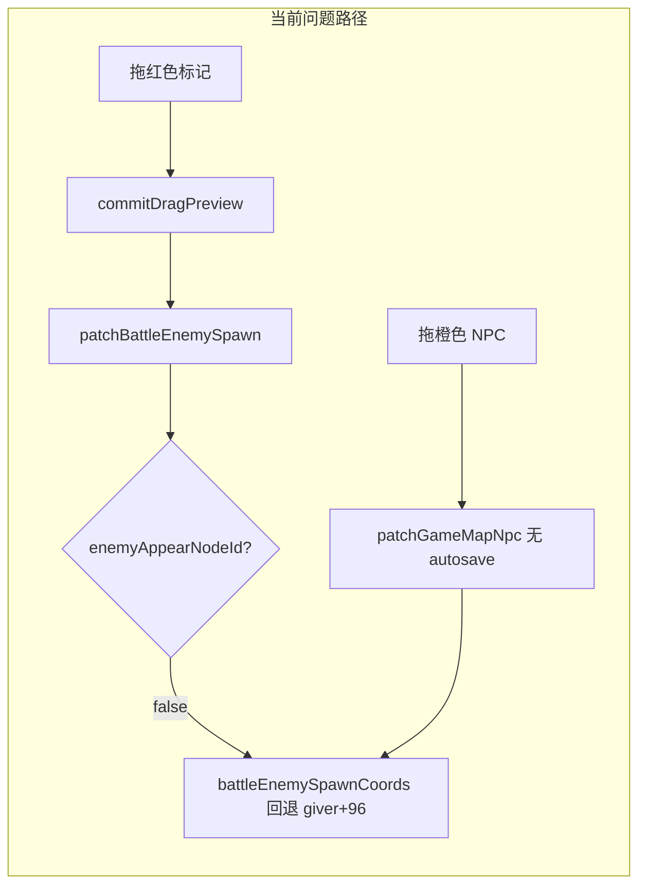
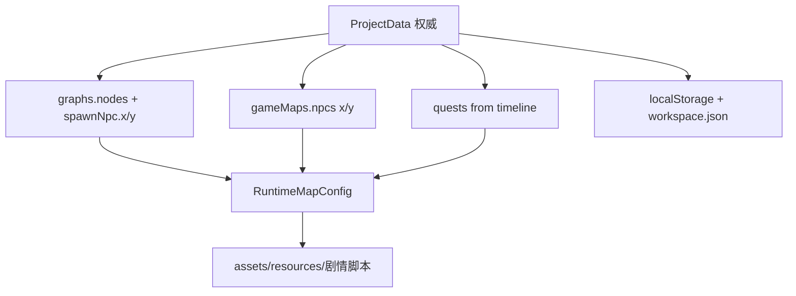

# Juben 战斗敌人摆点 Bug 修复与剧本功能全量排查

道友已确认：**保留地图拖拽为主，只修 bug、不改交互**。以下方案按此约束设计。

---

## 一、Bug 根因（已验证）

### 1. 敌人坐标与任务官「逻辑绑定」

[`battle-enemy-bind.ts`](Juben/src/editor/battle-enemy-bind.ts) 中 `battleEnemySpawnCoords` 在 `spawnStep.x/y` 缺失时回退到任务官偏移：

```115:125:Juben/src/editor/battle-enemy-bind.ts
export function battleEnemySpawnCoords(bind, giver) {
  const sx = bind.spawnStep?.x;
  const sy = bind.spawnStep?.y;
  if (Number.isFinite(sx) && Number.isFinite(sy)) {
    return { x: Math.round(sx!), y: Math.round(sy!) };
  }
  return { x: Math.round((giver.x ?? 192) + 96), y: Math.round(giver.y ?? 192) };
}
```

**表现**：未持久化独立坐标时，拖任务官 → 红色敌人标记跟着动；拖敌人后若 `spawnStep` 未写入 graph，松手即「还原」。

### 2. NPC 拖拽不触发 autosave

[`EditorRoot.vue`](Juben/src/editor/EditorRoot.vue) 中 `patchGameMapNpc` 仅 `Object.assign`，**无** `scheduleCurrentProjectSave()`；而 `onPatchBattleEnemy` 有 autosave。刷新/切项目后 NPC 坐标丢失，敌人若仍走回退逻辑会一起错位。

### 3. `patchBattleEnemySpawn` 静默失败

当 `resolveNpcBattleChain` 返回 bind 但 `enemyAppearNodeId === null`（链里只有 battle/战前节点、缺「敌人出现」action）时，`patchBattleEnemySpawn` 直接 `return false`，地图拖拽 commit 无效且无提示。

### 4. 拖拽开始时可能触发 `rebuildFlowFromGraph`

[`MapEditorView.vue`](Juben/src/editor/components/MapEditorView.vue) 的 `startBattleDrag` 在未选中时会 `emit('select-battle-enemy')` → [`onSelectBattleEnemy`](Juben/src/editor/EditorRoot.vue) 可能 `ensureBattleEnemyBranch` + `rebuildFlowFromGraph`，在极端时序下与拖拽 commit 竞争。



---

## 二、战斗摆点修复方案（保留拖拽）

### Fix A：坐标「物化」——彻底解耦任务官

在 [`battle-enemy-bind.ts`](Juben/src/editor/battle-enemy-bind.ts) 新增 `materializeBattleEnemySpawnCoords(project, gameMap, giverNpcUid)`：

- 若 `spawnStep` 已有有限 `x/y` → 不改动
- 否则用当前 `battleEnemySpawnCoords` 计算值 **写入** `spawnStep.x/y`（通过 `patchBattleEnemySpawn` 或等价逻辑）

**调用时机**（最小侵入）：

| 时机 | 文件 | 目的 |
|------|------|------|
| `ensureBattleEnemyBranch` / `wireUnifiedBattleEncounterChain` 创建后 | 已有初始 x/y，保持 | 新建即独立 |
| `onPatchBattleEnemy` 成功前若缺坐标 | `EditorRoot.vue` | 拖敌人前保证可写 |
| `patchGameMapNpc` 改 x/y 时 | `EditorRoot.vue` | **拖 NPC 前先物化该 NPC 关联的所有战斗敌人坐标**，再改 giver，敌人不再跟随 |
| `sanitizeProjectData` 末尾（可选一次性迁移） | `EditorRoot.vue` | 老项目批量补全 spawn 坐标 |

### Fix B：加固 `patchBattleEnemySpawn`

- 当 `enemyAppearNodeId` 缺失但存在 battle 链：自动补建「敌人出现」action 节点（复用 `ensureBattleEnemyBranch` 逻辑），再写坐标
- 返回值改为 `{ ok: boolean; reason?: string }` 或保留 boolean 并在 `EditorRoot` 侧检查 + `appConfirm`/toast 提示失败原因

### Fix C：NPC 拖拽 autosave 对称

[`patchGameMapNpc`](Juben/src/editor/EditorRoot.vue) 在 `Object.assign(npc, patch)` 且 patch 含 `x/y` 时调用 `scheduleCurrentProjectSave()`（与 battle 路径一致）。

### Fix D：拖拽时序优化（不改交互）

[`MapEditorView.vue`](Juben/src/editor/components/MapEditorView.vue)：

- `startBattleDrag`：**移除** pointerdown 时的 `select-battle-enemy` emit
- 新增 `@click.stop` 单独处理选中（与 NPC 标记 `@click.stop="emit('select-npc')"` 对称）
- 避免拖拽中途 `rebuildFlowFromGraph` 干扰 commit

### Fix E：回归测试

扩展 [`battle-enemy-bind.test.ts`](Juben/tests/battle-enemy-bind.test.ts)：

- 物化后拖 giver 不改变敌人坐标
- `enemyAppearNodeId` 缺失时 patch 仍能成功
- 新增 [`map-editor-drag.test.ts`](Juben/tests/)（纯函数级）：`materialize` + `patchGameMapNpc` 模拟序列

---

## 三、剧本功能全量排查（分级）

### P0 — 直接影响编辑/导出正确性

| 问题 | 位置 | 建议加固 |
|------|------|----------|
| NPC 坐标不持久化 | `EditorRoot.patchGameMapNpc` | Fix C |
| 战斗 spawn 坐标回退 | `battle-enemy-bind.ts` | Fix A |
| patch 静默失败 | `patchBattleEnemySpawn` | Fix B |
| `quests[]` vs `gameMap.tasks[]` 双源 | `quest-logic.ts`, `map-export.ts`, `map-import.ts` | import 后强制 `syncQuestsFromTimeline` + global check；export 文档化「仅 quests 权威」 |
| 每张地图 export 注入**全局** tasks | `map-export.ts` ~L690 | 改为 `buildRuntimeTasksForMap(project, gameMapId)` 过滤当前地图相关 quest |
| AI 流式中途 autosave 半成品 | `EditorRoot.vue` watch + `AiAssistantPanel.vue` | AI 生成期间 `suspendAutosave` flag，结束后再 flush |

### P1 — 衔接与数据更新风险

| 问题 | 位置 | 建议 |
|------|------|------|
| appear 仅 export 时 patch | `map-export-pipeline.ts` | global check 增加「export 预检 diff」或编辑器内 `previewExportAppear` |
| import 不回写坐标/拓扑 | `map-import.ts` | UI 明确提示；可选「从 runtime 同步坐标」开关 |
| `exportMergeJson` 会话丢失 | `EditorRoot.vue` | 写入 `gameMap.runtimeShell` 或 workspace meta |
| quest sync 非全路径触发 | `timeline-logic.ts` | portal title/taskId 变更时统一 `syncQuestsFromTimeline` |
| `createTaskChain` 幂等但不更新坐标 | `ai-task-chain-sync.ts` | brief 含 x/y 时 patch gameMap npc |
| 双标签页 last-write-wins | `persistence.ts` | 短期：`updatedAt` 冲突提示；中期：project 级 revision |

### P2 — 体验与健壮性

| 问题 | 建议 |
|------|------|
| 无 undo/redo | 参考 Quest Weaver / 学术节点编辑器反馈：优先 graph 节点操作 undo |
| global check 后 flow 闪选 | 已有 `setTimeout(0)`，可 debounce rebuild |
| `wireOpenChainTailsToExit` 死代码 | 删除或接入 AI finalize |
| battle unified vs split 导出校验 | global check 前置 `migrateQuestBattlePatterns` 报告 |

### 数据流权威模型（排查基准）



**原则**（参考 [ORK Framework Quest Tasks + Navigation Markers](https://orkframework.com/guide/documentation/features/quests/)）：编辑器内每种实体（任务官摆点、战斗敌人 spawn、quest 元数据）应有**单一权威字段**；派生/回退值仅用于初始化，一旦用户编辑即物化持久化。

---

## 四、市面参考与可借鉴优化

| 参考 | 可借鉴点 | 对应 Juben 动作 |
|------|----------|-----------------|
| [ORK Framework Quests](https://orkframework.com/guide/documentation/features/quests/) | Quest Task 拆分 + Navigation Marker 独立坐标 | 战斗敌人 spawn 与 giver 完全独立存储（Fix A） |
| [Godot Quest Weaver](https://github.com/undomick/godot_nexus_quest_weaver) | 子图/分支节点、变量占位 | 已有 graph 结构；可加强 global check DAG 可达性 |
| [Wx3 Mission Editor](https://wx3.com/building-the-mission-system-for-an-open-world-rpg/) | 表单 + 图双编辑、条件/动作分 lane | Inspector spawnNpc x/y 与地图拖拽双写同一字段 |
| Quest DAG 最佳实践 | 无环、可达性、无死锁 | 扩展 `global-check-repair.ts` 检测 orphan portal / open tail |

---

## 五、实施顺序与验收

### 阶段 1（本次必做 — 战斗摆点）

1. `materializeBattleEnemySpawnCoords` + 调用链（Fix A）
2. `patchBattleEnemySpawn` 加固（Fix B）
3. `patchGameMapNpc` autosave + 物化（Fix C）
4. `MapEditorView` 选中/拖拽分离（Fix D）
5. 单元测试（Fix E）

**验收判据**：

- 拖红色敌人标记 → 松手后刷新页面，位置不变
- 拖橙色任务官 → 红色敌人**不**跟随（除非从未单独设过敌人位置且未跑物化——物化后必不跟随）
- 无「敌人出现」节点的旧链，拖敌人仍可保存
- `npm test` 在 `Juben/` 下 battle-enemy-bind 相关用例全绿

### 阶段 2（剧本衔接加固 — 建议同 PR 或紧随其后）

1. AI 生成 suspend autosave
2. export tasks 按 map 过滤
3. import 后 auto syncQuests
4. patch 失败 UI 提示

### 阶段 3（中长期）

- workspace 冲突检测
- export/import round-trip 测试
- quest graph DAG 校验

---

## 六、涉及文件清单

**必改**：
- [`Juben/src/editor/battle-enemy-bind.ts`](Juben/src/editor/battle-enemy-bind.ts)
- [`Juben/src/editor/EditorRoot.vue`](Juben/src/editor/EditorRoot.vue)
- [`Juben/src/editor/components/MapEditorView.vue`](Juben/src/editor/components/MapEditorView.vue)
- [`Juben/tests/battle-enemy-bind.test.ts`](Juben/tests/battle-enemy-bind.test.ts)

**阶段 2 可选**：
- [`Juben/src/editor/map-export.ts`](Juben/src/editor/map-export.ts)
- [`Juben/src/editor/map-import.ts`](Juben/src/editor/map-import.ts)
- [`Juben/src/editor/components/AiAssistantPanel.vue`](Juben/src/editor/components/AiAssistantPanel.vue)
- [`Juben/src/editor/persistence.ts`](Juben/src/editor/persistence.ts)
