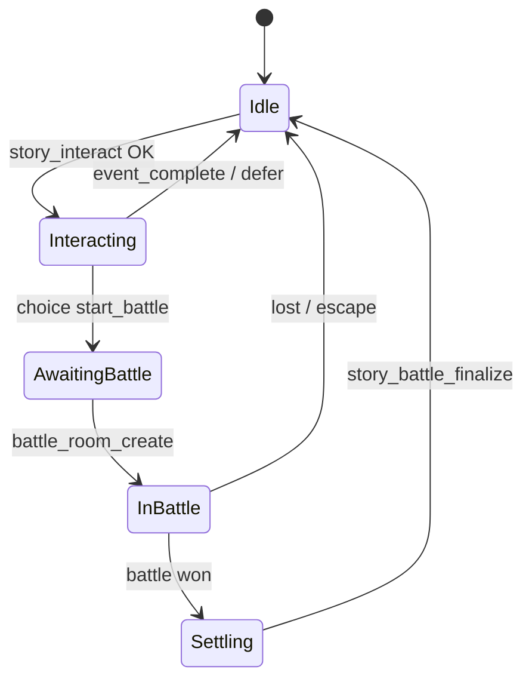

# 剧情系统技术规范（Story System Spec）

> **版本**：manifest v2 · 2026-08-29（编辑器 UX：2026-09 起剧情侧改为操作面板，无无线画布）  
> **排期**：[story-system-plan.md](./story-system-plan.md)  
> **策划手册**：[STORY_MIGRATION.md](../assets/Script/Game/STORY_MIGRATION.md)  
> **契约源**：[`Juben/data/client-runtime-manifest.json`](../Juben/data/client-runtime-manifest.json)

---

## 1. 架构分层

```
Juben（L1 编辑） ──publish──► map JSON + manifest（L2 契约）
                                      │
                    ┌─────────────────┴─────────────────┐
                    ▼                                   ▼
            StoryManager（L3a 表现）              story_service（L3b 权威）
            编排 UI / 动画 / 提示                  条件判定 / 效果执行 / 持久化
```

### L1 编辑器工作台（产品形态）

| 工作台 | 用途 | 主界面 |
|--------|------|--------|
| **剧情** | 写章节 / 任务链 / 对白选项 / 战斗结构；AI 生成润色 | 操作面板（步骤列表 + 右侧属性 + AI），**不是**节点无限画布 |
| **摆点** | 把剧情 NPC/敌人落到地图坐标与形象 | `MapEditorView` 地图拖拽；可「从剧情套用摆点」 |

共享同一 `ProjectData` / `workspace.json`。导出 `map_*.json` 契约不变，与画布 UI 无关。

### 铁律

1. 客户端不得本地发奖、不得单方面标记任务完成（`storyRuntimeMode=local-preview` 除外）。
2. 编辑器不得直连游戏 WebSocket；唯一出口是 publish 双写。
3. 新增 requirement/effect 必须先改 manifest `capabilities`，再改三端（五步法见 plan §7）。

---

## 2. 数据模型

### 2.1 蓝图（静态）

| 资产 | 路径 |
|------|------|
| Cocos JsonAsset | `assets/resources/Sample/剧情脚本/map_{mapId}.json` |
| Server 剧情 | `server/data/story_maps/map_{mapId}_{mapCode}.json` |
| 战斗模板 | `server/data/battle_refs.json` |
| 能力契约 | `Juben/data/client-runtime-manifest.json` |

### 2.2 实例（每角色 Mongo）

| 字段 | 说明 |
|------|------|
| `completed_event_ids` | 已完成事件 |
| `active_tasks` / `completed_task_ids` | 任务状态 |
| `mainline_step` | 主线步骤 |
| `revealed_npc_uids` / `spawned_npc_uids` / `dynamic_npcs` | NPC 显现 |
| `pending_battle` | 剧情战 FSM（§4.2） |
| `pending_story_settlement` | 断线待 finalize 提示 |

---

## 3. WebSocket 命令

| 命令 | 职责 |
|------|------|
| `story_get_state` | 拉取进度 + settlement 提示 |
| `story_interact` | 交互预校验；可写 `pending_battle` |
| `story_event_complete` | 完成事件；执行 effects（幂等） |
| `battle_room_create` | 创建房间；`story_event_id` 绑剧情战 |
| `story_battle_finalize` | 胜利后权威结算 |
| `bag_has_items` | 剧情查背包（全量 item_id，无分页限制） |

**已废弃**：`story_battle_start` → 使用 `battle_room_create(story_event_id)`。

---

## 4. 状态机

### 4.1 交互主流程



### 4.2 pending_battle（服务端）

```
authorized → creating → in_room → battle_finished → completing → completed
                ↘ cancelled / battle_failed
```

实现：`server/services/story_battle_service.py`  
客户端恢复：`BattleResumeController.ts`（阶段 2 去除 Test.ts 竞态）

---

## 5. Manifest v2 能力分档

| 档位 | 含义 | 导出 | 客户端求值 |
|------|------|------|------------|
| **supported** | 三端一致 | 允许 | 必须实现 |
| **serverOnly** | 服务端权威执行 | 允许 | 不求值（仅 Tips） |
| **planned** | 未实现 | **禁止** | strict 下 false |

### 5.1 Requirements

| type | 档位 |
|------|------|
| `event_done`, `task_*`, `level`, `mainline_step`, `item_owned` | supported |
| `story_var_equals`, `has_pet`, `bag_space_at_least`, `activity_switch_on` | planned |

### 5.2 Effects

| action | 档位 |
|--------|------|
| `task_accept`, `task_complete`, `teleport`, `spawn_npc`, `reveal_npc` | supported |
| `give_item`, `add_exp`, `send_mail` | serverOnly |
| `take_item`, `set_story_var` | planned |

### 5.3 客户端 strict 规则

- `storyRuntimeMode=server-development`：`unknownRequirementPasses=false`（默认）
- `storyRuntimeMode=local-preview`：`unknownRequirementPasses=true`（仅离线验收）

---

## 6. 发布与测试

```bash
# Juben 发布
cd Juben && npm run publish:map -- {mapCode}

# 全量门禁（jjfb 根）
npm run test:story-gate
```

手动验收：`artifacts/e2e_story_settlement/.../COCOS_MANUAL_CHECKLIST.md`

---

## 7. 变更记录

| 日期 | 变更 |
|------|------|
| 2026-08-29 | manifest v2；strict requirement；阶段 0 契约冻结 |
